# Guide to the three MacroDroid macros

[한국어](GUIDE.ko.md) | **English**

Hi, I'm **chajunoni**. I've shared three MacroDroid macros I use every day as templates. This guide covers installing, using them, Quick Settings tiles and widgets, and installing the optional MD Helper (including what to do when Google Play Protect blocks it).

- 💬 Message Alerts — keyword alerts + auto reply: https://www.macrodroidlink.com/macrostore?id=32176
- 🅿️ Parking Map — remembers where (and on which floor) you parked: https://www.macrodroidlink.com/macrostore?id=32177
- ⏰ Alarm Auto — Turbo Alarm driven by your weekdays, calendar and holidays: https://www.macrodroidlink.com/macrostore?id=32178
- Illustrated guide on GitHub: https://github.com/chamr94/md-helper/blob/main/docs/GUIDE.en.md

## 1. Install

1. Tap a link above on your phone to open the template in MacroDroid. (Or MacroDroid → [Templates] tab at the bottom → search "chajunoni".)
2. Tap the template to open the macro editor, then tap the **save (✓)** button at the bottom right.
3. Allow the permissions it asks for (notification access, location, calendar… depending on the macro).

Note: **please don't rename the macros** — updates replace the macro with the same name. MacroDroid may translate the name when you install it; that's fine, just keep it as it is.

Screens follow your phone language (English or Korean). Your settings and history are kept across updates.

## 2. Opening a macro (all three)

- **Quick Settings tile**: pull down the notification shade twice → pencil (edit) → drag the MacroDroid tiles **알람 설정** (alarm icon), **메시지 알리미** (chat icon) and **주차 지도** (car icon) into your tiles. Tap one to open that macro.
- **Home screen widget**: long-press an empty spot on the home screen → Widgets → MacroDroid → drag the **Custom** widget → in [Select Widget] pick **알람자동설정**, **메시지 알리미** or **주차 지도**.
- **Macro list**: long-press the macro in MacroDroid → [Test actions].
- Tapping an update notification also opens the macro.
- Back does nothing in these windows; close them with [Close] or the Home button.

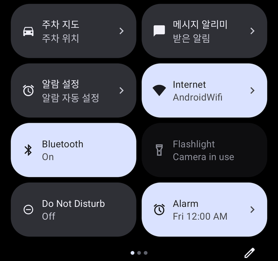 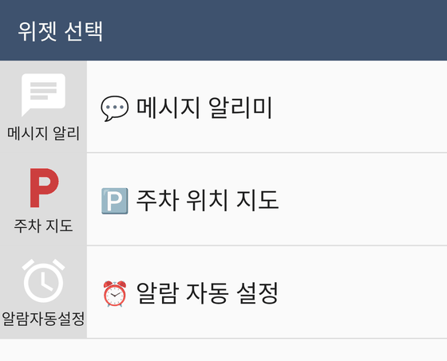

(Tile and widget names are fixed in Korean — tell them apart by their icons.)

## 3. 💬 Message Alerts

Alerts you only for messenger notifications that contain your keywords, and replies for you when you are busy. Needs **notification access** for MacroDroid.

### First setup

1. Open the window and tap **[Settings]**.
2. **Alerts** tab: apps to watch (app names exactly as shown in notifications, e.g. KakaoTalk, Messages), keywords (e.g. meeting, deadline, your name), important keywords (red text, strong vibration, optional sound), always-alert names (e.g. Mom), words and names to ignore, and a schedule (days, time ranges, dates, holidays).
3. **Replies** tab: turn on auto reply and write your reply. Save three replies and switch with one tap. Apps to reply in, words that call you (your name or nickname — replies even in group chats), always reply in 1:1 chats, names to skip, and the reply interval (30 min by default).
4. **Popup** tab: show unread alerts when unlocking, show again back at home, remove opened alerts, lock screen summary.
5. **More** tab: version, [Check for updates], MD Helper status.
6. Tap **[← Back to list]** to save (changes apply right away).

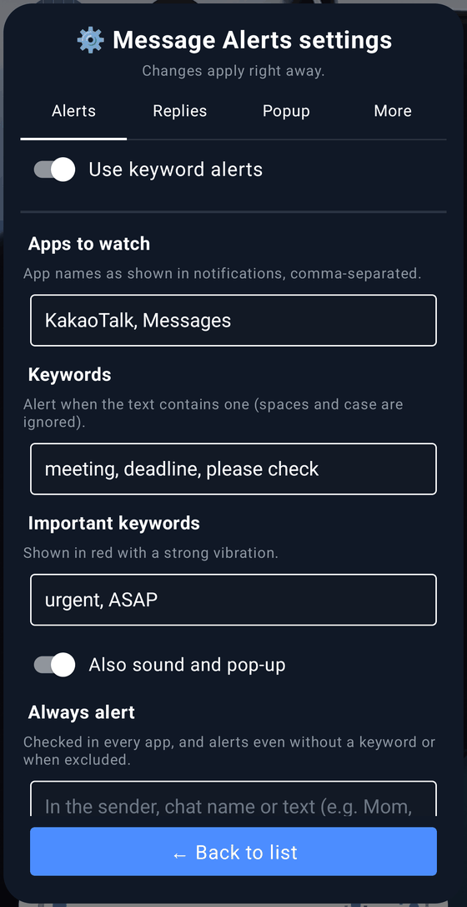 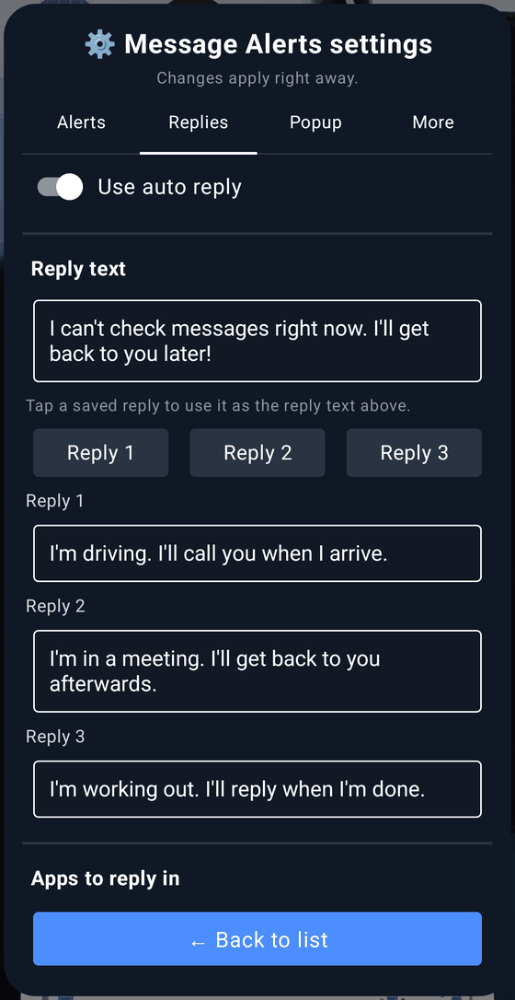

### Using it

- When a keyword alert arrives while you use the phone, the **🔔 new alert** window pops up. Tap an alert to open its app (the exact chat with MD Helper).
- Alerts that arrive while locked are collected and shown together when you unlock. [Later] shows them again next time.
- The list window (tile or widget) shows received alerts, and its switches turn keyword alerts and auto reply on or off. [Clear] empties the list.
- Auto-replied alerts show **🤖 Auto-replied** and the text that was sent. The same person gets another reply only after the interval.
- KakaoTalk alerts have no chat name, so KakaoTalk only gets a reply when a message calls you.

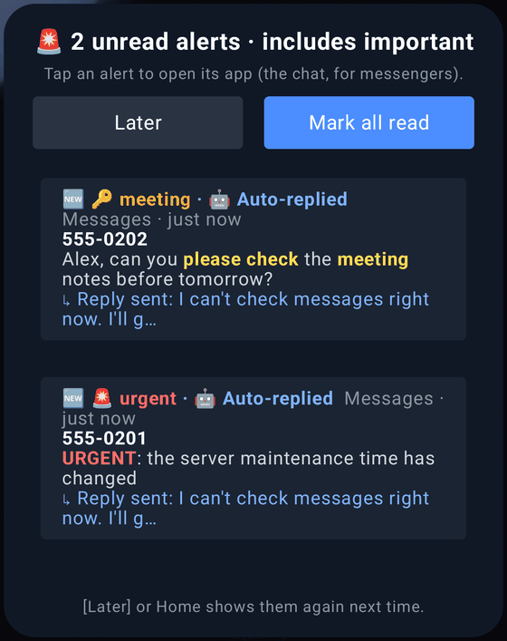 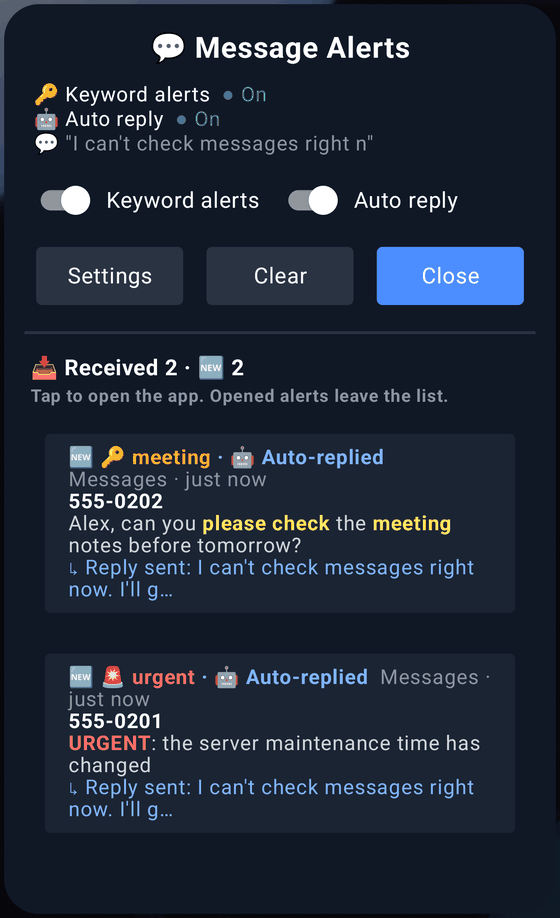

Here it is in action (Korean UI). Left: unread keyword texts are collected into the **🔔 new alert** window when you unlock. Right: tapping an alert opens the exact chat, and an auto reply goes out when you are busy.

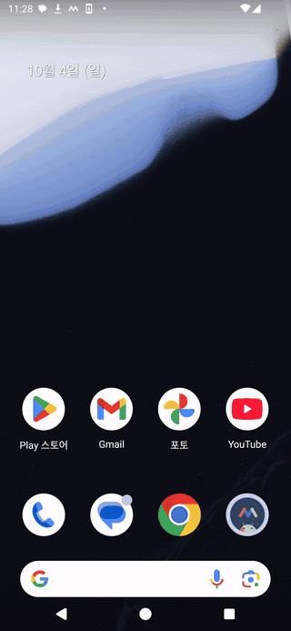 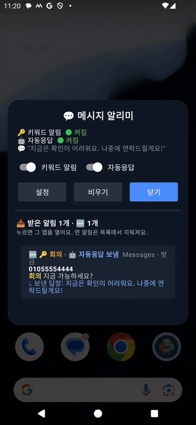

## 4. 🅿️ Parking Map

Saves your parking spot when you get out of the car (car Bluetooth disconnects or Android Auto ends). No need to pick your car: it recognizes car Bluetooth by device type (rental cars too). Needs **location** permission.

### First setup

1. Open the window → **[Settings]** at the bottom → at home (or your garage entrance) tap **[Set current location as Home]**. The Wi-Fi you are on is remembered as your home Wi-Fi.
2. **Floor list**: your home garage floors, one per line (max 12). It asks with these buttons when you park at home.
3. **Car recognition**: install MD Helper (section 6). Without it, run once from a PC: `adb shell pm grant com.arlosoft.macrodroid android.permission.DUMP` (with neither, it saves only when Android Auto ends).

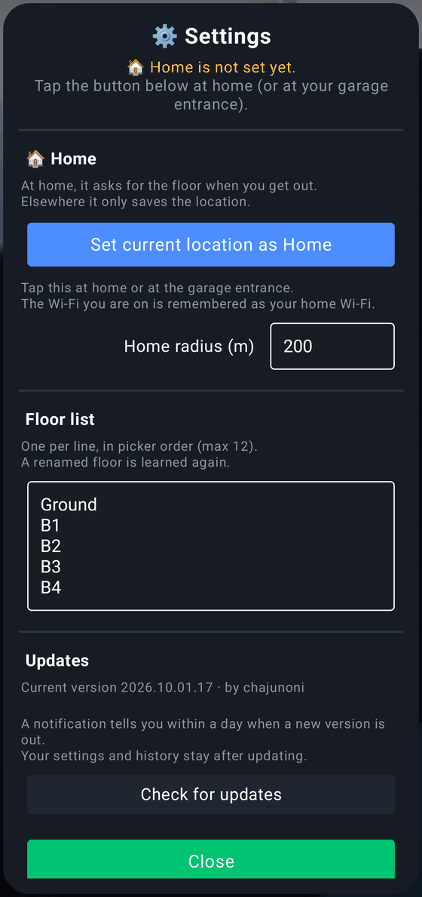

### Using it

- When you get out of the car, a **🅿️ parking** notification appears. Tap it to see a pin on the map; tap the pin or its label for walking directions in Google Maps (or Naver/Kakao Map).
- Add a **floor** (B5–5F, tap again to clear), a **note** (e.g. zone C, pillar 12) and a **[Pillar photo]** (take it, then press Back).
- To save without a car, tap **[Save this spot]** (later [Save again]).
- At your home garage it asks for the floor right away. With MD Helper it guesses the floor from the barometer and pre-selects it (it gets better as you choose).
- Opening a map app shows the parking notification again, and on weekday mornings (6–10 am) leaving your home Wi-Fi shows the floor you parked on.

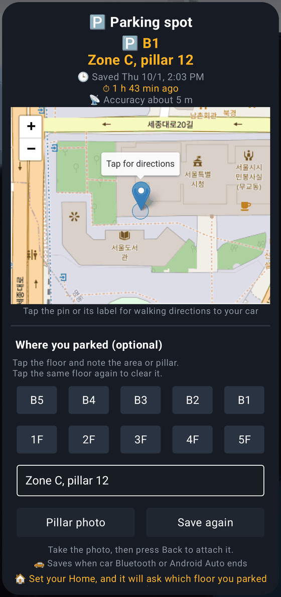

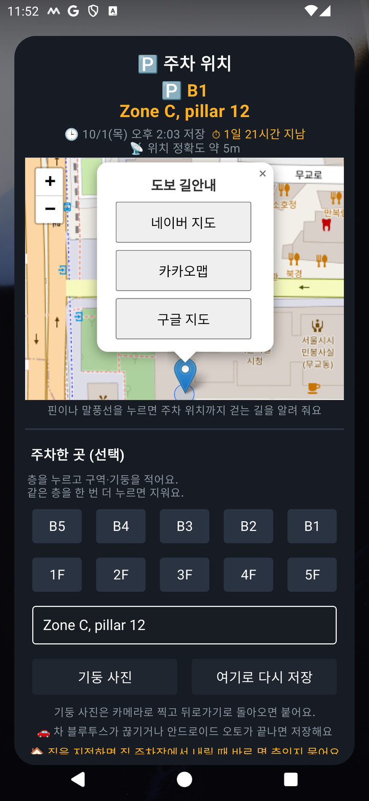 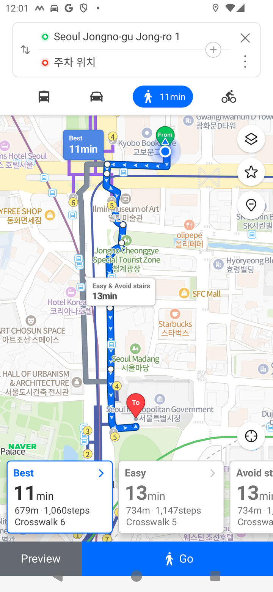

Left GIF: **[Save again]** stores your current spot and shows it on the map. Right GIF: tapping the pin gives walking directions in Naver / Kakao / Google Maps (the example is about a 10-minute walk; Korean UI).

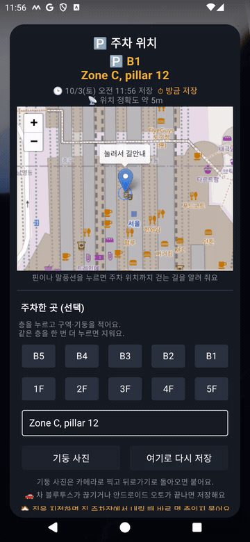 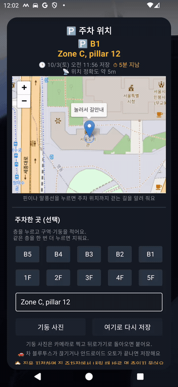

## 5. ⏰ Alarm Auto

Turns **Turbo Alarm** alarms on and off and creates them for you, following your weekdays, calendar and public holidays. Needs the Turbo Alarm app and **calendar** permission. Your calendar and holiday calendar are picked automatically.

### First setup

1. If Turbo Alarm isn't installed, the macro shows an install prompt → [Install] in the Play Store, open Turbo Alarm once, finish its intro and allow notifications.
2. **Morning** tab, **Alarm name** (default "Work alarm"): the macro turns this Turbo Alarm alarm on and off and sets its time. The first time you **close** the settings window, it creates this morning alarm in Turbo Alarm for you (also if you install Turbo Alarm later). Renaming recreates it under the new name and deletes the old one. Rename it **only here** — if you rename or delete it in Turbo Alarm, the macro can't find it (a 'Please check your morning alarm' notification); tap **[Recreate in Turbo]** on the Morning tab to create it again with this name.
3. **Morning** tab: on/off and time per weekday (24-hour), sound, volume and vibration, day-off keywords (e.g. vacation, PTO — morning and lunch alarms are off that day), also off on public holidays, extra-shift keywords (rings a set time before that event).
4. **Lunch** tab: weekday and extra-shift times (to the second), only when at the office (tap [Set current location as office] there), [Test now].
5. **Events** tab: minutes before events, per-keyword lead times (e.g. airport|flight=120, dentist=30), keywords to skip, event alarm sound.

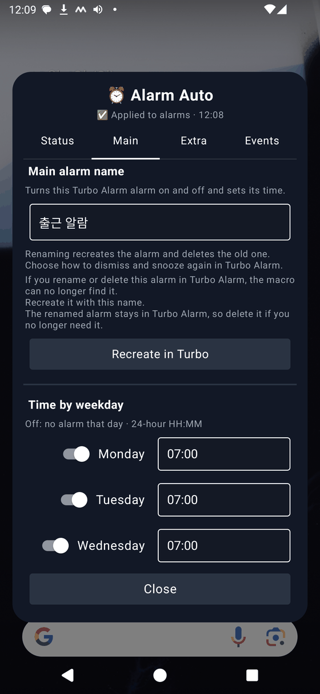 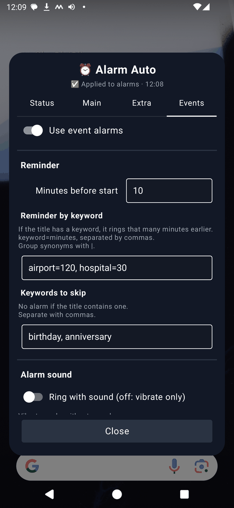

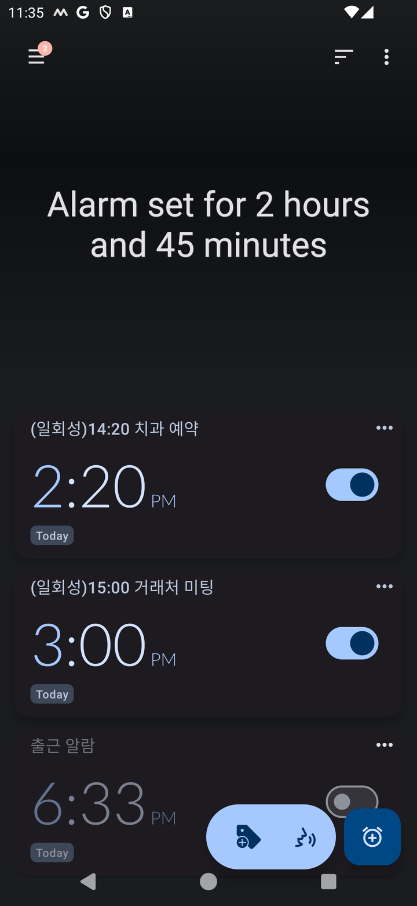

### Using it

- Changes are applied to Turbo Alarm within 1–2 seconds. The **Status** tab shows the next morning alarm and a 7-day preview.
- Event alarms are created in Turbo Alarm 24 hours ahead as "(Once)time title", and change or disappear when the event changes.
- Write "leave at 1 pm", "remind me 40 min before" or "prep 1 hour before" in the event note and it uses that time.

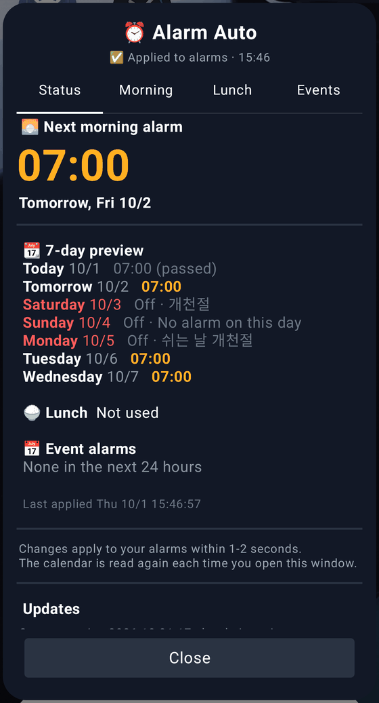 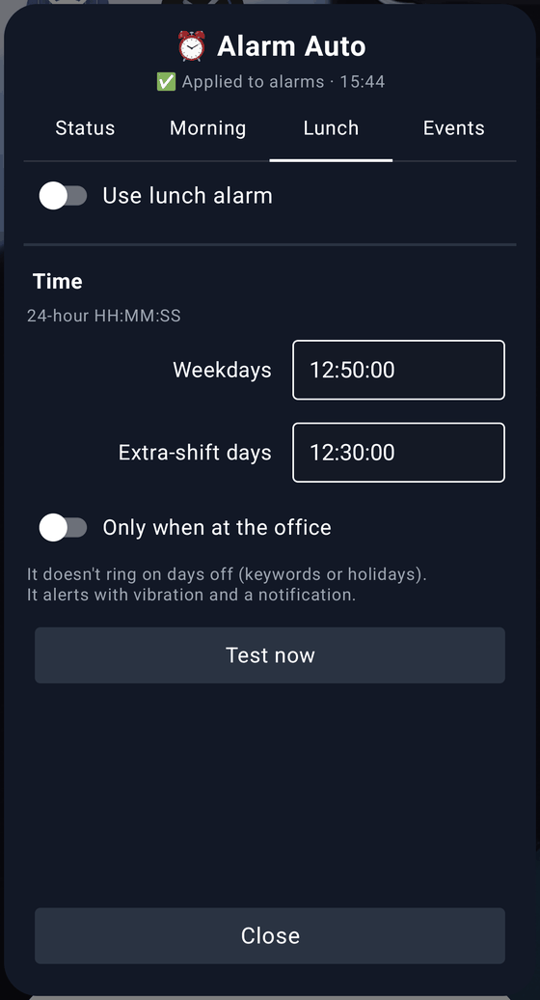

The main feature is **one-time calendar alarms**. Add a calendar event (write "leave at 3 pm" in the note and it matches that time); it appears in Status and is really created in Turbo Alarm as a "(Once)…" alarm.

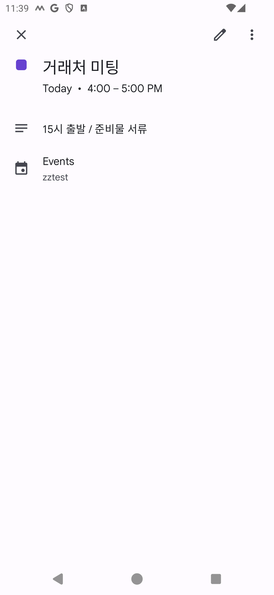 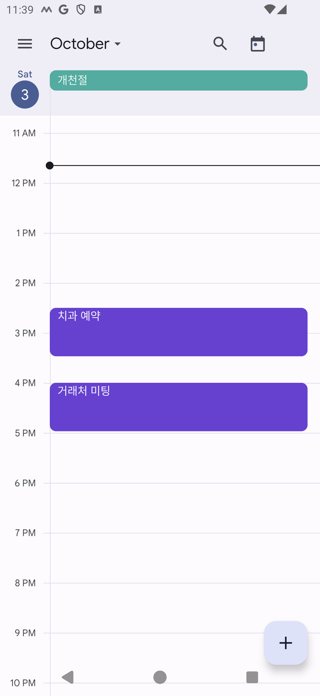

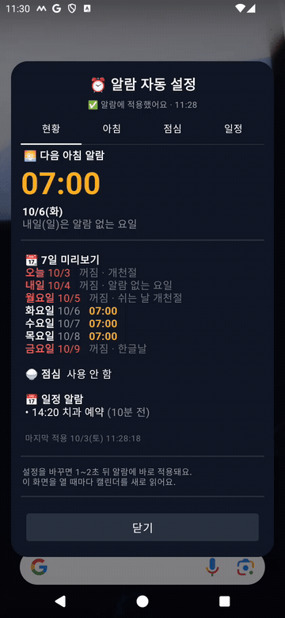

## 6. 🧩 MD Helper (optional) — installing it past Play Protect

A small helper app for things MacroDroid cannot do on its own (**no internet permission**, open source: https://github.com/chamr94/md-helper). Message Alerts opens the exact chat and uses less battery; Parking Map recognizes your car and guesses the floor from the barometer.

When an app downloaded with a browser uses a sensitive permission such as **notification access**, Google Play Protect blocks the install to prevent fraud. Follow these steps to install it.

### ① Download

1. Tap [Install MD Helper] in a macro window — a window lists these steps → **[Start download]** (or open: https://github.com/chamr94/md-helper/releases/latest/download/mdhelper.apk).
2. If Chrome says "File might be harmful", tap **[Download anyway]**.
3. Tap **[Open]** → in "Install unknown apps" tap **[Settings]** → turn on **Allow from this source** → go back → **[Install]**.

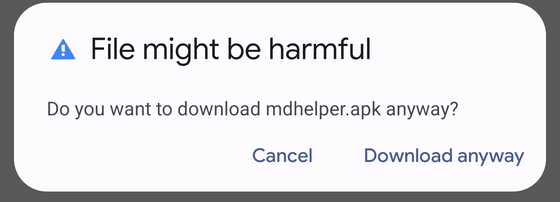

### ② If you see "App blocked to protect your device" (Play Protect)

1. Play Store → your **profile** icon (top right) → **Play Protect** → **gear** (top right).
2. Turn off **Scan apps with Play Protect** and choose **[Pause]** (scanning turns back on automatically the next day).
3. Open the downloaded file again (mdhelper.apk in Downloads) → **[Install]**.
4. You can turn scanning back on right after installing. The helper stays installed (a rescan reports "No harmful apps found").

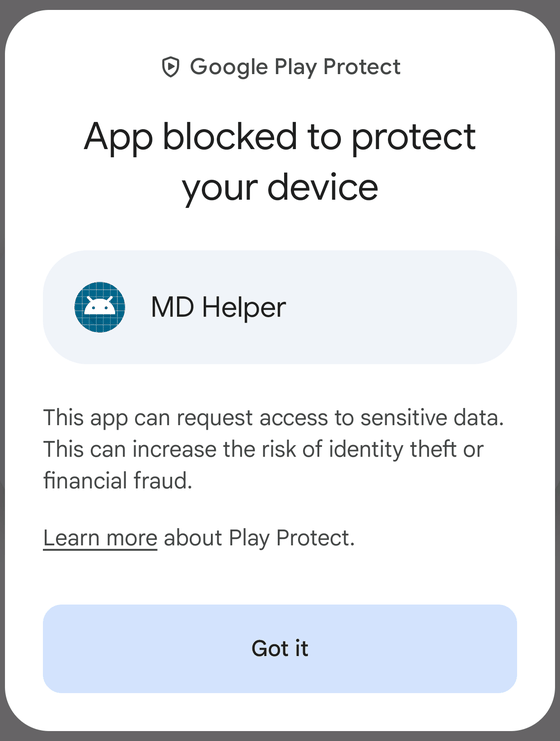 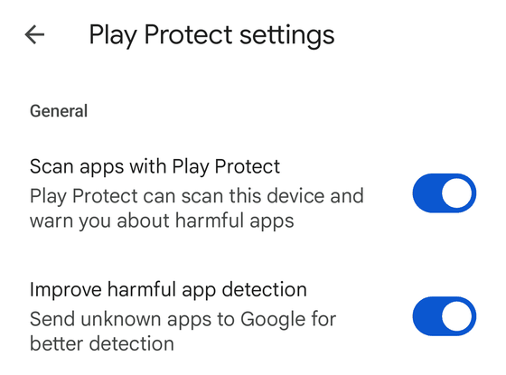

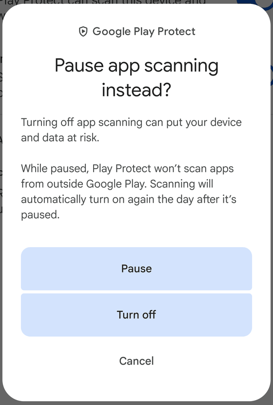

Samsung phones may block it earlier with **Auto Blocker**: Settings → Security and privacy → Auto Blocker → off. You can turn it back on afterwards, but it may also block MD Helper updates — turn it off briefly if an update fails.

### ③ Turn on notification access (if you see "Restricted setting")

1. Open MD Helper → **[Turn on notification access]** → MD Helper → turn on.
2. If you see "Restricted setting — For your security, this setting is currently unavailable": tap **[Open app info]** in MD Helper (or Settings → Apps → **MD Helper**) → **⋮** (top right) → **Allow restricted settings** (confirm with your screen lock).
3. Again [Turn on notification access] → turn on → **[Allow]**.
4. For Parking Map, also tap **[Grant Bluetooth permission]** in MD Helper (car recognition).

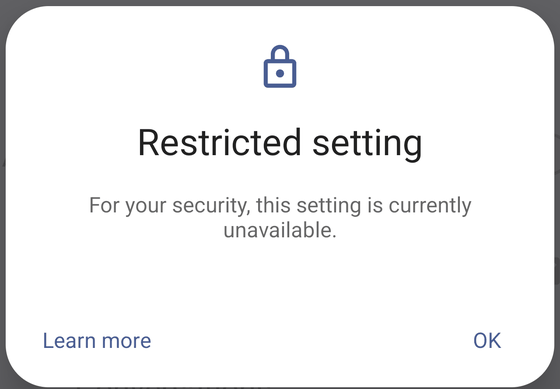 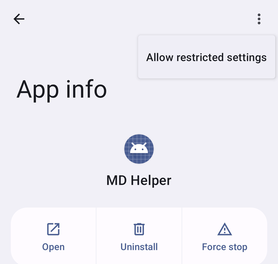

## 7. Updates

- Each macro checks for a new version once a day and notifies you. Tap the notification to see **[Update]** at the top of the window; it downloads the new file and opens the import screen → save button at the bottom right → **[Overwrite]**. Settings and history stay.
- If a permission prompt (e.g. accessibility service) appears after [Overwrite], grant it and tap the **save button once more**. MacroDroid deletes the old macro before saving, so leaving now leaves you without the macro (settings remain — just open the file again and save).
- You can also check right away with **[Check for updates]** in the settings. Without "All files access" for MacroDroid it downloads with your browser.
- If the macro was renamed (e.g. translated), the update comes in as a new macro — delete the old one afterwards.
- **[Update MD Helper]** appears only when a helper feature that macro uses has changed. The first time you need "Allow from this source" and [Update]; after that it updates without asking.

## 8. FAQ

- **Nothing opens**: check that MacroDroid's main switch and the macro are on.
- **Tile and widget names are Korean** (English phones): they are fixed names — use the icons (alarm, chat bubble, car).
- **No alerts** (Message Alerts): make sure the app names match the names shown in notifications and keyword alerts are on.
- Questions and bug reports are welcome in the comments. Thanks!
