# MacroDroid 매크로 3개 사용 설명서

**한국어** | [English](GUIDE.en.md)

안녕하세요, **chajunoni**입니다. 직접 만들어 쓰던 MacroDroid 매크로 3개를 템플릿으로 올렸어요. 설치부터 쓰는 법, 빠른 설정 타일·위젯, MD 도우미 설치(Play 프로텍트에 막힐 때 포함)까지 정리했어요.

- 💬 메시지 알리미 — 키워드 알림 + 자동응답: https://www.macrodroidlink.com/macrostore?id=32176
- 🅿️ 주차 위치 지도 — 차에서 내리면 주차 위치·층 기억: https://www.macrodroidlink.com/macrostore?id=32177
- ⏰ 알람 자동 설정 — Turbo Alarm을 요일·캘린더·공휴일에 맞춰: https://www.macrodroidlink.com/macrostore?id=32178
- 사진이 든 설명서(깃허브): https://github.com/chamr94/md-helper/blob/main/docs/GUIDE.ko.md

## 1. 설치

1. 폰에서 위 링크를 누르면 MacroDroid 템플릿 화면이 열려요. (또는 MacroDroid → 아래 [템플릿] 탭 → 검색에 chajunoni)
2. 템플릿을 누르면 매크로 편집 화면이 열려요. 오른쪽 아래 **저장(✓)** 버튼을 누르면 끝이에요.
3. 권한을 물으면 허용해 주세요(매크로마다 알림 접근·위치·캘린더 등).

※ **매크로 이름은 바꾸지 마세요.** 업데이트가 같은 이름의 매크로를 덮어써요. 폰 언어가 영어 등이면 이름이 번역돼 들어올 수 있는데, 그대로 두면 돼요.

※ 화면 글자는 폰 언어(한국어·영어)를 따라요. 설정과 기록은 업데이트해도 그대로 남아요.

## 2. 매크로 창 여는 법 (세 매크로 공통)

- **빠른 설정 타일**: 알림창을 두 번 내려 연필(편집) 버튼 → MacroDroid 타일 중 **알람 설정**·**메시지 알리미**·**주차 지도**를 위쪽으로 끌어다 놓아요. 누르면 그 매크로 창이 열려요. (삼성: 빠른 설정 패널 → 연필 또는 ⋮ → 버튼 편집)
- **홈 화면 위젯**: 홈 화면 빈 곳을 길게 누르기 → 위젯 → MacroDroid → **직접 설정** 위젯을 끌어다 놓기 → [위젯 선택]에서 **알람자동설정**·**메시지 알리미**·**주차 지도** 중 하나를 골라요.
- **매크로 목록**: MacroDroid의 매크로 목록에서 매크로를 길게 누르고 [동작 테스트].
- 업데이트 알림을 눌러도 그 매크로 창이 열려요.
- 창은 뒤로가기로는 닫히지 않고, [닫기]나 홈 버튼으로 닫혀요.

 

## 3. 💬 메시지 알리미

메신저 알림 중 내가 정한 키워드가 들어간 것만 골라 알려 주고, 바쁠 때는 대신 답장해 줘요. 필요: MacroDroid **알림 접근** 권한.

### 처음 설정

1. 창을 열고 **[설정]**을 눌러요.
2. **키워드** 탭: 알림 받을 앱(알림에 보이는 앱 이름 그대로, 예: 카카오톡, 메시지), 키워드(예: 회의, 마감, 내 이름), 중요 키워드(빨간색·강한 진동, 알림음도 고를 수 있음), 항상 알릴 이름·문구(예: 엄마), 알리지 않을 단어·이름, 예약(요일·시간대·날짜·공휴일).
3. **자동응답** 탭: 자동응답 사용을 켜고 보낼 문구를 적어요. 자주 쓰는 문구 3개를 저장해 두고 버튼 하나로 바꿀 수 있어요. 답장할 앱, 나를 부르는 말(이름·별명 — 단톡방에서도 답장), 개인톡은 항상 답장, 답장하지 않을 이름, 답장 간격(기본 30분).
4. **알림 창** 탭: 잠금을 풀 때 보여 주기, 홈으로 오면 다시 띄우기, 연 알림 지우기, 잠금 화면 요약.
5. **기타** 탭: 버전·[업데이트 확인], MD 도우미 상태.
6. **[← 목록으로]**를 누르면 저장돼요(바꾸면 바로 적용).

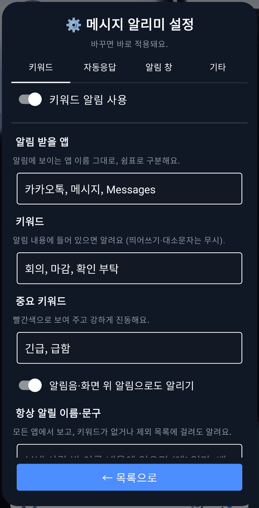 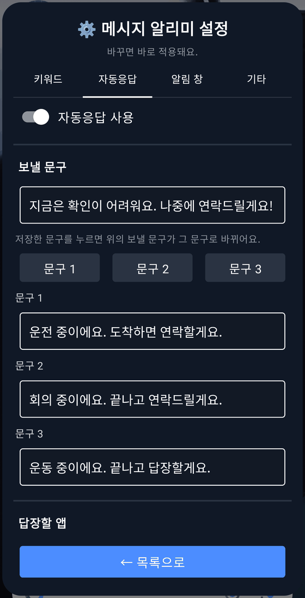

### 쓰는 법

- 폰을 쓰는 중에 키워드 알림이 오면 **🔔 새 알림** 창이 바로 떠요. 알림을 누르면 그 앱이 열려요(MD 도우미가 있으면 그 대화방까지).
- 잠겨 있을 때 온 알림은 모아 두었다가 잠금을 풀 때 한 창에 보여 줘요. [나중에]를 누르면 다음에 다시 보여 줘요.
- 목록 창(타일·위젯)에서 받은 알림을 다시 보고, 맨 위 스위치로 키워드 알림·자동응답을 바로 켜고 꺼요. [비우기]로 목록을 지워요.
- 자동응답을 보낸 알림에는 **🤖 자동응답 보냄**과 보낸 문구가 보여요. 같은 상대에게는 답장 간격이 지나야 다시 보내요.
- 카카오톡은 알림에 방 이름이 오지 않아서, 부르는 말이 있을 때만 답장해요.

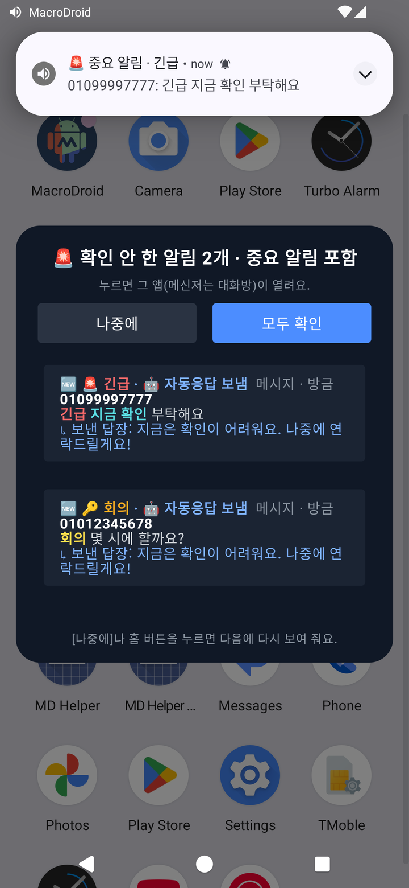 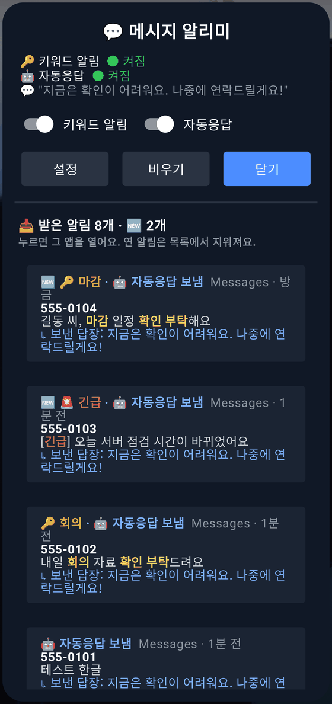

실제로 쓰는 모습이에요(기다리는 부분만 잘라 냄): ① 타일로 창을 열고 **설정**의 키워드·자동응답 탭 → ② 홈 화면에서 기다리다 키워드 문자가 오면 **🔔 새 알림** 창이 뜨고, 받은 알림을 누르면 그 대화방이 열려요 → ③ 목록 창에서 **자동응답**을 켜고 문자가 오면 바로 답장이 나가고(🤖 자동응답 보냄), 누르면 답장이 나간 대화방이 열려요.

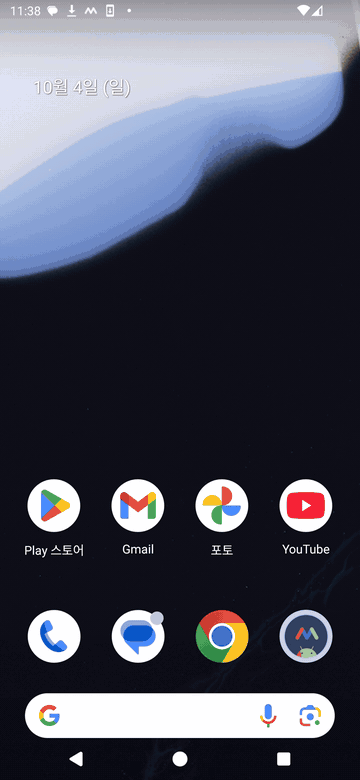

## 4. 🅿️ 주차 위치 지도

차에서 내리면(차 블루투스가 끊기거나 안드로이드 오토가 끝나면) 주차 위치를 저장해요. 트리거에서 차를 고를 필요 없이 블루투스 기기 종류로 차를 알아봐요(렌트카도). 필요: **위치** 권한.

### 처음 설정

1. 창을 열고 맨 아래 **[설정]** → 집(또는 집 주차장 입구)에서 **[지금 위치를 집으로 지정]**. 그때 붙어 있는 Wi-Fi를 집 Wi-Fi로 기억해요.
2. **층 목록**: 집 주차장의 층을 한 줄에 하나씩(최대 12개). 집에서 내릴 때 이 버튼들로 물어봐요.
3. **차 알아보기**: MD 도우미(아래 6번)를 설치하면 끝이에요. 도우미 없이 쓰려면 MacroDroid에 `DUMP` 권한을 한 번 주면 돼요 — PC 없이 **MD 도우미 — adb 권한** 앱(아래 6-2)으로, 또는 PC에서 `adb shell pm grant com.arlosoft.macrodroid android.permission.DUMP` (둘 다 없으면 안드로이드 오토가 끝날 때만 저장).

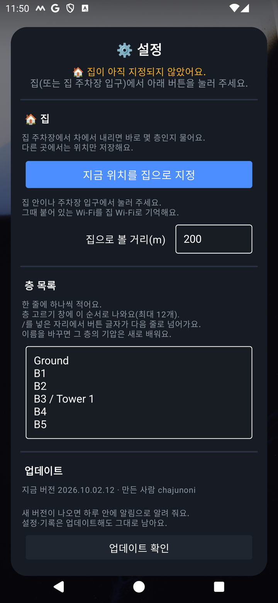

### 쓰는 법

- 차에서 내리면 **🅿️ 주차 위치** 알림이 떠요. 누르면 지도에 핀으로 보여 주고, 핀이나 말풍선을 누르면 네이버·카카오·구글 지도로 걷는 길을 안내해요.
- **층 버튼**(B5~5F, 같은 층을 한 번 더 누르면 지움)·**메모**(예: C구역 12번 기둥)·**[기둥 사진]**(카메라로 찍고 뒤로가기)을 남길 수 있어요.
- 차 없이 지금 위치를 저장하려면 **[지금 위치로 저장]**(저장한 뒤에는 [여기로 다시 저장]).
- 집 주차장에서 내리면 바로 몇 층인지 묻는 창이 떠요. MD 도우미가 있으면 기압으로 층을 짐작해 먼저 골라 둬요(고를수록 정확해져요).
- 지도 앱(네이버·카카오·구글 지도)을 열면 주차 알림을 다시 보여 주고, 평일 아침(6~10시) 집 Wi-Fi가 끊기면 주차한 층을 보여 줘요.

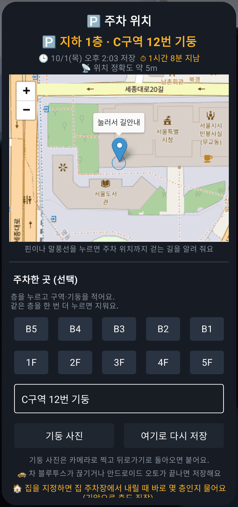

 

왼쪽 GIF: **[여기로 다시 저장]**을 누르면 지금 위치를 저장하고 지도에 바로 표시해요. 오른쪽 GIF: 핀을 누르면 네이버·카카오·구글 지도 중 하나로 걷는 길을 안내해요(예시는 약 10분 거리).

 

## 5. ⏰ 알람 자동 설정

**Turbo Alarm** 앱의 알람을 요일·캘린더·공휴일에 맞춰 알아서 켜고 끄고 만들어요. 필요: Turbo Alarm 앱, **캘린더** 권한. 캘린더(구글·삼성)와 공휴일 캘린더는 폰마다 알아서 골라요.

### 처음 설정

1. Turbo Alarm이 없으면 창을 열 때 설치 안내가 떠요 → [설치하기]로 Play 스토어에서 설치하고, Turbo Alarm을 한 번 열어 첫 안내를 넘기고 알림 권한을 허용해요.
2. **아침** 탭의 **알람 이름**(기본 "출근 알람"): 매크로는 Turbo Alarm에서 이 이름의 알람을 켜고 끄고 시각을 바꿔요. 처음에 설정 창을 한 번 열었다 **닫으면** Turbo Alarm에 이 이름의 아침 알람을 만들어 줘요(Turbo Alarm을 나중에 깔아도 그 뒤 창을 닫으면 만들어요). 이름을 바꾸면 새 이름으로 다시 만들고 예전 것은 지워요. 이름은 **이 칸에서만** 바꿔 주세요 — Turbo Alarm 앱에서 바꾸거나 지우면 매크로가 그 알람을 찾지 못해요('아침 알람을 확인해 주세요' 알림). 그럴 땐 아침 탭의 **[Turbo에 다시 만들기]**를 누르면 이 이름으로 다시 만들어요.
3. **아침** 탭: 요일별 켜기·시각(24시간제), 알람 소리·음량·진동, 쉬는 날 키워드(예: 연차, 휴가 — 그날은 아침·점심 알람을 꺼요), 공휴일에도 끄기, 휴일근무 키워드(그날은 일정 몇 분 전에 울림).
4. **점심** 탭: 평일·휴일근무 날 시각(초 단위), 회사 안에 있을 때만 울리기(회사에서 [지금 위치를 회사로 지정]), [지금 울려보기].
5. **일정** 탭: 일정 몇 분 전, 키워드별 미리알림(예: 공항|비행기=120, 병원=30), 알람을 만들지 않을 키워드, 일정 알람 소리.

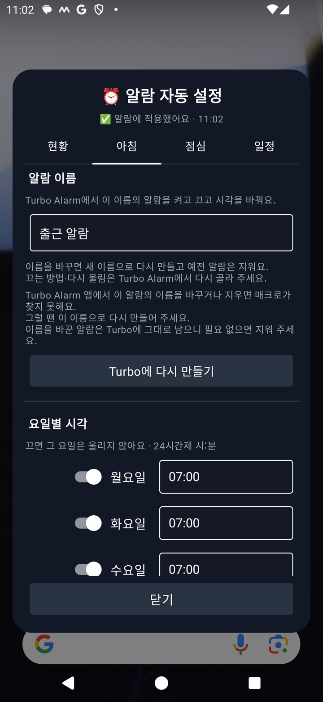 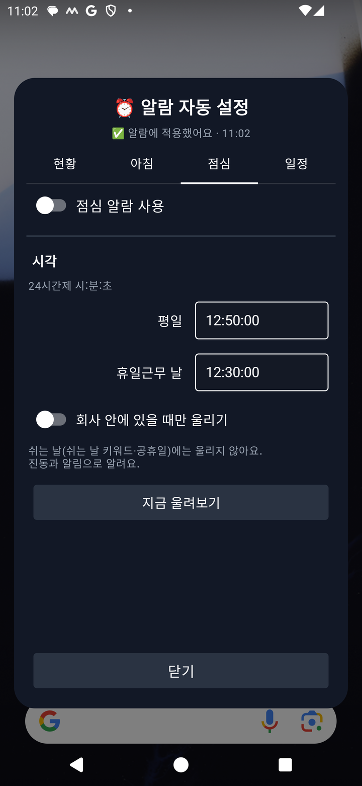

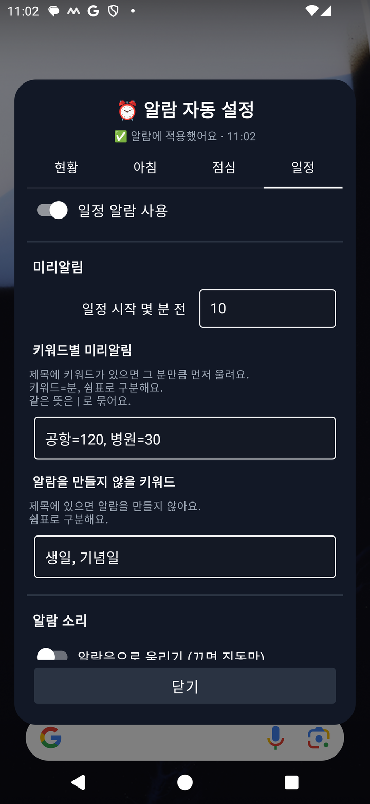

### 쓰는 법

- 설정을 바꾸면 1~2초 뒤 Turbo Alarm에 바로 적용돼요. **현황** 탭에서 다음 아침 알람과 7일 미리보기를 확인해요.
- 일정 알람은 울리기 24시간 전에 Turbo Alarm에 "(일회성)시각 제목"으로 만들어지고, 일정이 바뀌면 같이 바뀌거나 지워져요.
- 일정 메모에 "13시 출발", "40분 전에 알려줘", "1시간 전 준비"처럼 적으면 그 시각에 맞춰요.

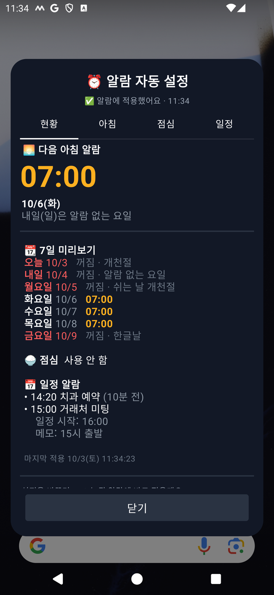 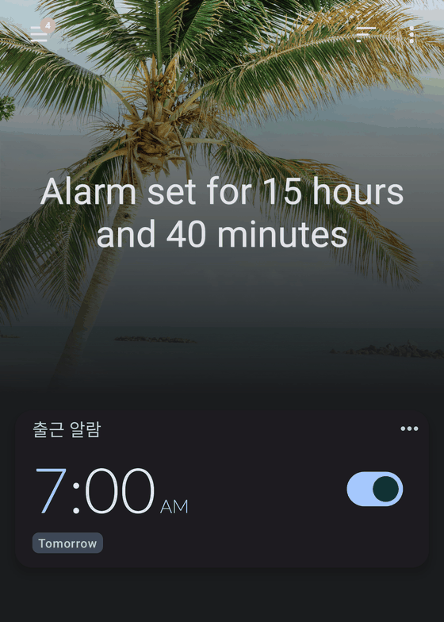

주 기능은 **캘린더 일회성 알람**이에요. 캘린더에 일정을 넣고 메모에 "15시 출발"처럼 적으면 그 시각에 맞춰, 현황에 뜨고 Turbo Alarm에 "(일회성)…" 알람으로 실제로 만들어져요.

 

## 6. 🧩 MD 도우미 (선택) — 설치와 Play 프로텍트 우회

MacroDroid만으로는 못 하는 일을 대신 하는 작은 앱이에요(**인터넷 권한 없음**, 소스 공개: https://github.com/chamr94/md-helper). 메시지 알리미는 대화방까지 바로 열고 배터리를 덜 쓰고, 주차 위치 지도는 차를 알아보고 기압으로 층을 짐작해요.

브라우저로 받은 앱이 **알림 접근** 같은 민감한 권한을 쓰면, Google Play 프로텍트가 사기 방지를 위해 설치를 막아요. 아래 순서대로 하면 설치할 수 있어요.

### ① 받기

1. 매크로 창의 [MD 도우미 설치]를 누르면 아래 순서를 정리한 창이 떠요 → **[받기 시작]**(또는 이 주소를 직접 열어요: https://github.com/chamr94/md-helper/releases/latest/download/mdhelper.apk).
2. 크롬이 "파일이 유해할 수 있음"을 띄우면 **[무시하고 다운로드]**.
3. 다 받으면 **[열기]** → "출처를 알 수 없는 앱" 창에서 **[설정]** → **이 출처 허용**을 켜고 뒤로 → **[설치]**.

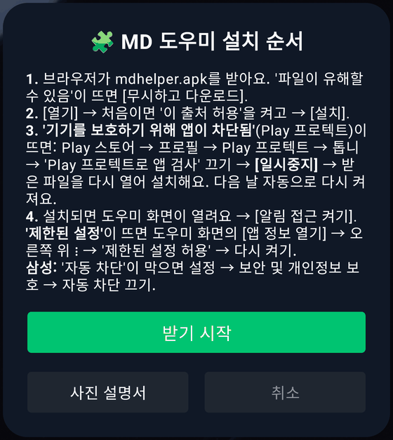 

### ② "기기를 보호하기 위해 앱이 차단됨"이 뜨면 (Play 프로텍트)

1. Play 스토어 → 오른쪽 위 **프로필** → **Play 프로텍트** → 오른쪽 위 **톱니(설정)**.
2. **Play 프로텍트로 앱 검사**를 끄고 **[일시중지]**를 눌러요(다음 날 자동으로 다시 켜져요).
3. 받은 파일(다운로드 폴더의 mdhelper.apk)을 다시 열어 **[설치]**.
4. 설치가 끝나면 같은 곳에서 앱 검사를 다시 켜도 돼요. 설치된 도우미는 그대로 남아요(다시 검사해도 "유해한 앱 없음").

 

※ 삼성 폰은 그 전에 **자동 차단**이 설치를 막을 수 있어요: 설정 → 보안 및 개인정보 보호 → 자동 차단 → 끄기. 설치한 뒤 다시 켜도 되지만, 켜 두면 도우미 업데이트도 막힐 수 있으니 그때는 잠깐 꺼 주세요.

### ③ 알림 접근 켜기 ("제한된 설정"이 뜨면)

1. MD 도우미를 열고 **[알림 접근 켜기]** → MD 도우미 → 켜기.
2. "제한된 설정 — 보안을 위해 이 설정은 현재 사용할 수 없습니다"가 뜨면: 도우미 화면의 **[앱 정보 열기]**(또는 설정 → 애플리케이션 → **MD 도우미**) → 오른쪽 위 **⋮** → **제한된 설정 허용**(잠금 화면 인증).
3. 다시 [알림 접근 켜기] → 켜기 → **[허용]**.
4. 주차 위치 지도를 쓰면 도우미 화면의 **[블루투스 권한 허용]**도 눌러 주세요(차 알아보기).

 

## 6-2. 🔑 PC 없이 adb 권한 주기 (선택) — MD 도우미 · adb 권한

MacroDroid의 몇몇 기능(보안 설정 쓰기, 로그캣 트리거, `dumpsys`로 상태 읽기 등)은 PC에서 adb 명령으로 주는 권한이 있어야 해요. **MD 도우미 — adb 권한** 앱은 폰에 들어 있는 **무선 디버깅**으로 그 명령을 폰 안에서 대신 실행해요. 6자리 코드로 한 번만 페어링하면 돼요. 받기·자세한 사용법(GIF): https://github.com/chamr94/md-helper-adb

- MacroDroid: `WRITE_SECURE_SETTINGS`, `CHANGE_CONFIGURATION`, `DUMP`, `READ_LOGS`, `SET_VOLUME_KEY_LONG_PRESS_LISTENER` + 사용 기록 접근.
- MacroDroid **공식 헬퍼**가 없으면 공식 주소에서 받아 설치해요(안드로이드 14부터는 PC로만 설치되던 것) + `WRITE_SECURE_SETTINGS`·배터리 최적화 예외. 설치 뒤 이어서 뜨는 화면에서 **[계속] → [확인]**.
- MD 도우미가 깔려 있으면 알림 접근도 켜 줘서 위 ③의 "제한된 설정" 단계가 없어져요.
- 안드로이드 11 이상, Wi-Fi에 연결된 상태가 필요해요.

1. 앱을 열고 **[무선 디버깅으로 권한 주기] → [진행]**.
2. 처음 한 번 접근성의 **MD 도우미 설정 안내**를 켜면, 설정 화면마다 다음에 누를 곳을 배너로 알려 줘요.
3. 배너를 따라 **빌드번호 7번 → 개발자 옵션 → 무선 디버깅 켜기 → 페어링 코드로 기기 페어링**.
4. 6자리 코드가 뜨면 **알림창을 내려 배너 알림의 입력칸에 코드를 넣고 보내요** → **✅ 완료**. 무선 디버깅은 다시 꺼도 돼요.

 

## 7. 업데이트

- 매크로가 하루 한 번 새 버전을 확인해서 알림으로 알려 줘요. 알림을 누르면 창 위에 **[업데이트]**가 보이고, 누르면 새 파일을 받아 가져오기 화면을 열어요 → 오른쪽 아래 저장 버튼 → **[덮어쓰기]**. 설정·기록은 그대로 남아요.
- [덮어쓰기] 뒤에 권한 안내 창(접근성 서비스 등)이 뜨면 권한을 켜고 **저장 버튼을 한 번 더** 눌러 주세요. MacroDroid는 예전 매크로를 먼저 지우고 저장하므로, 그냥 나가면 매크로가 없어진 채로 남아요(설정은 남아 있으니 파일을 다시 열어 저장하면 돼요).
- 설정의 **[업데이트 확인]**으로 바로 확인할 수도 있어요. MacroDroid에 "모든 파일 접근" 권한이 없으면 브라우저로 받아요.
- 매크로 이름이 바뀌어 있으면(번역 등) 새 매크로로 들어오니, 다 되면 예전 매크로를 지워 주세요.
- **[MD 도우미 업데이트]**는 그 매크로가 쓰는 도우미 기능이 바뀌었을 때만 보여요. 처음 한 번은 "이 출처 허용"과 [업데이트]를 눌러야 하고, 그 뒤로는 확인 없이 업데이트돼요.

## 8. 자주 묻는 것

- **창이 안 떠요**: MacroDroid 첫 화면의 스위치가 켜져 있는지, 매크로가 켜져 있는지 확인해 주세요.
- **타일·위젯 이름이 한국어예요**(영어 폰): 이름이 고정이라 그래요. 아이콘(알람·말풍선·자동차)으로 구분해 주세요.
- **알림이 안 와요**(메시지 알리미): 알림 받을 앱 이름이 알림에 보이는 이름과 같은지, 키워드 알림 스위치가 켜져 있는지 확인해 주세요.
- 질문이나 버그는 댓글로 알려 주세요. 고맙습니다!
